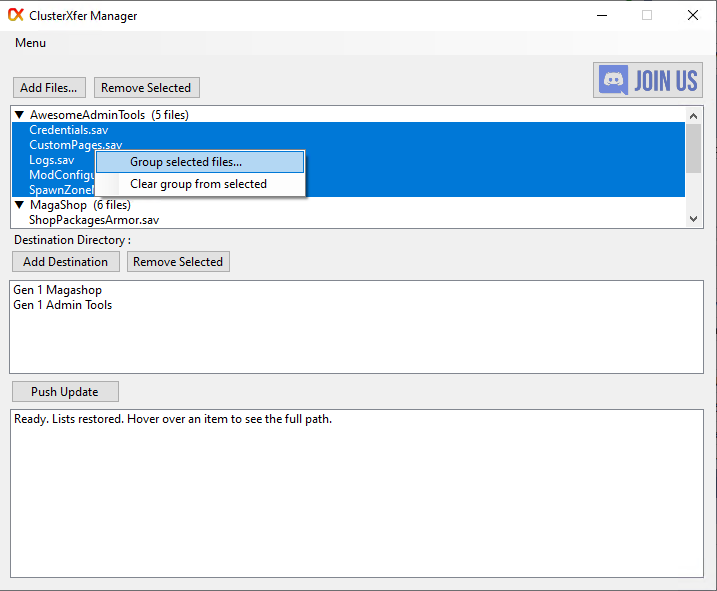

# ClusterXfer Manager

**ClusterXfer Manager** is a simple Windows tool for pushing selected files to one or more destinations.

It supports both **local folders** and **FTP servers** (including game server hosts such as Nitrado).

## Safety / Virus Scan

This program is clean according to VirusTotal:

**[View VirusTotal Report](https://www.virustotal.com/gui/file/c6ae12facfbb6ebcf0791dc333df3964008c035288084183ec4d9f3245e225f8)**

Scanned by 70+ antivirus engines.

## Features

- Add files from your computer or from an FTP server
- Add destinations (local folders or FTP folders)
- Select exactly which files go to which destinations
- Group files under custom names such as **QoL Server**
- Files inside a group are organized by folder (for example MagaShop and AwesomeAdminTools)
- Collapse and expand groups or folders in the file list
- Rename destination labels without changing the real folder or FTP path
- Full FTP folder browser with path navigation
- Remembers your lists between sessions
- Remembers last used FTP credentials
- Works with multiple sources and multiple destinations at once

## How to Use

1. Click **Add Files…**
   - Choose Local files or FTP
2. Click **Add Destination…**
   - Choose a local folder or an FTP folder
3. Optional: select files, right-click, and choose **Group selected files...**
4. Select the files, group, or folder you want to send
5. Select the destination(s) you want to send them to
6. Click **Push Update**

### Grouping and collapsing

- Right-click selected files → **Group selected files...** to give them a name
- Click a group or folder line to expand or collapse it
- Selecting a group header sends every file in that group
- Selecting a folder header sends only that folder’s files
- Right-click a destination → **Rename destination...** to change the display name only

## Requirements

- Windows 10 or Windows 11
- .NET 6 or later (or .NET Framework 4.8 depending on how it was built)

## Notes

- FTP passwords are stored locally on your computer only.
- The program does not send any data anywhere except to the FTP servers you configure.

## Images

## Version

1.3
