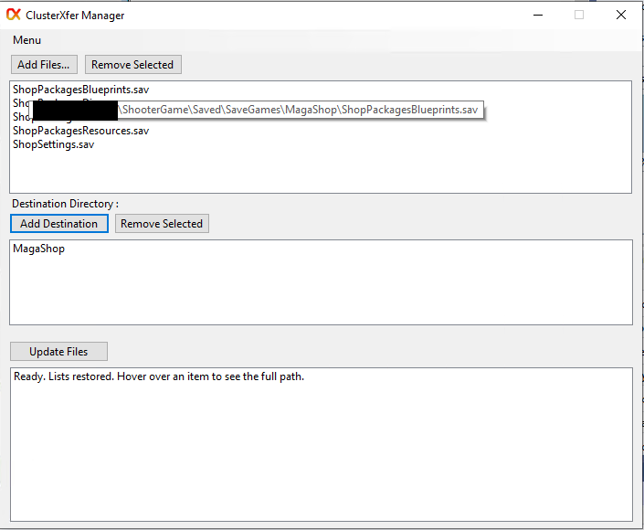
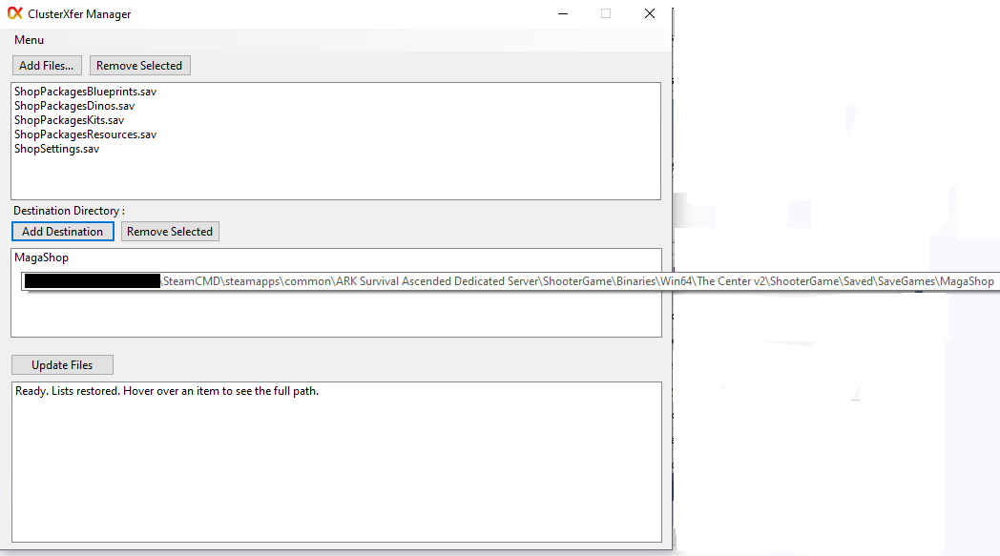
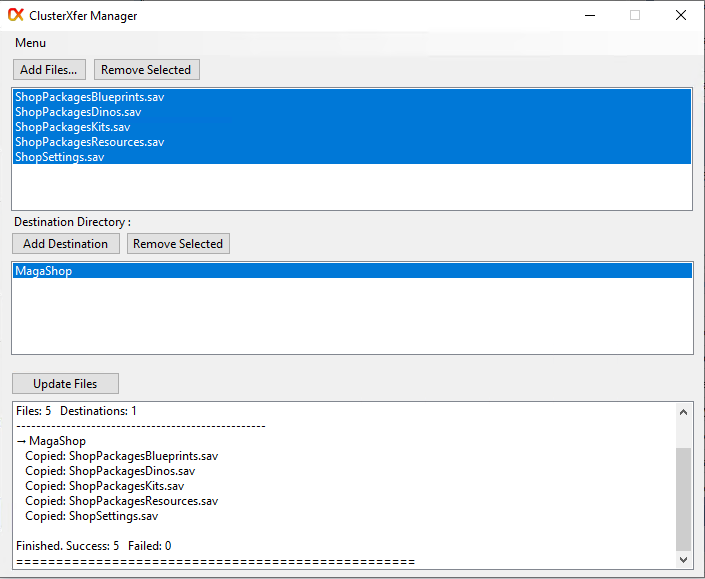

# ClusterXfer Manager

**ClusterXfer Manager** is a simple Windows tool for pushing selected files to one or more destinations.

It supports both **local folders** and **FTP servers** (including game server hosts such as Nitrado).

## Features

- Add files from your computer or from an FTP server
- Add destinations (local folders or FTP folders)
- Select exactly which files go to which destinations
- Full FTP folder browser with path navigation
- Remembers your lists between sessions
- Remembers last used FTP credentials
- Works with multiple sources and multiple destinations at once

## How to Use

1. Click **Add Files…**  
   - Choose Local files or FTP
2. Click **Add Destination…**  
   - Choose a local folder or an FTP folder
3. Select (highlight) the files you want to send
4. Select (highlight) the destinations you want to send them to
5. Click **Push Update**

## Requirements

- Windows 10 or Windows 11
- .NET 6 or later (or .NET Framework 4.8 depending on how it was built)

## Notes

- FTP passwords are stored locally on your computer only.
- The program does not send any data anywhere except to the FTP servers you configure.

# Images

## Version

1.0
